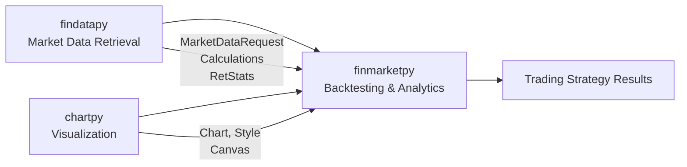
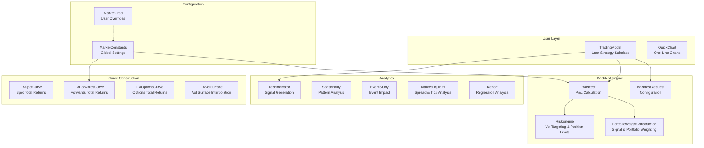

# finmarketpy Documentation

> **Last Updated**: 2026-04-06T16:25:30Z  \
> **Git Hash**: `a7176d7`

finmarketpy is a Python library for backtesting trading strategies and analyzing financial market data, developed by [Cuemacro](https://www.cuemacro.com). It provides prebuilt templates for strategy backtesting, seasonality analysis, event studies, FX pricing, and risk management with volatility targeting.

- **Version**: 0.11.19
- **License**: Apache 2.0
- **Python**: 3.13+
- **Author**: Saeed Amen ([@cuemacro](https://github.com/cuemacro))
- **Repository**: [github.com/cuemacro/finmarketpy](https://github.com/cuemacro/finmarketpy)

## Key Features

- **Strategy Backtesting** -- Define trading strategies with `BacktestRequest`, execute via `BacktestEngine`, analyze with `TradeAnalysis`. Supports transaction costs, volatility targeting, position limits, stop loss/take profit, and parallel parameter sweeps.
- **Technical Indicators** -- SMA, EMA, RSI, Bollinger Bands, ROC, ATR and more via `TechIndicator`, with automatic signal generation (+1/-1) and filtering (long-only, short-only, flip).
- **FX Pricing & Total Return Indices** -- Construct total return indices for FX spot (with carry), FX forwards (with roll logic), and FX options. Includes FX volatility surface interpolation via SABR/Clark models (FinancePy integration).
- **Market Analytics** -- Seasonality analysis (intraday, daily, monthly), event studies around economic releases, market liquidity metrics, and network analysis of asset correlations.
- **Visualization** -- One-line charting via `QuickChart` using chartpy backends (matplotlib, plotly, bokeh). Multi-panel dashboards with Canvas for strategy reports.
- **Parallel Processing** -- Configurable threading/multiprocessing for parameter sweeps and portfolio-level backtesting via findatapy's `SwimPool`.

## Ecosystem

finmarketpy is part of the Cuemacro trio of libraries that work together:



| Library | Role | Key Classes Used by finmarketpy |
|---------|------|-------------------------------|
| [findatapy](https://github.com/cuemacro/findatapy) | Market data download, caching, time series calculations | `MarketDataRequest`, `Market`, `Calculations`, `RetStats`, `Filter`, `SwimPool` |
| [chartpy](https://github.com/cuemacro/chartpy) | Unified plotting across matplotlib/plotly/bokeh | `Chart`, `Style`, `Canvas`, `ChartConstants` |
| [financepy](https://github.com/domokane/FinancePy) | FX options pricing (optional) | `FXVolSurfacePlus`, `DiscountCurveFlat` |

## Architecture Overview



## Component Overview

### `src/finmarketpy/backtest/` -- Strategy Backtesting

| Class | File | Purpose |
|-------|------|---------|
| `BacktestRequest` | `backtestrequest.py` | Configuration object (inherits `MarketDataRequest`): dates, TC, vol target, position limits |
| `Backtest` | `backtestengine.py` | Core P&L engine: applies signals to returns with TC, vol scaling, stop/take profit |
| `TradingModel` | `backtestengine.py` | Abstract base class for user strategies with plotting and analysis helpers |
| `PortfolioWeightConstruction` | `backtestengine.py` | Signal-level and portfolio-level weight optimization |
| `RiskEngine` | `backtestengine.py` | Volatility targeting, leverage calculation, position clipping |
| `TradeAnalysis` | `tradeanalysis.py` | Post-backtest sensitivity analysis (TC shock, parameter sweeps) |
| `BacktestComparison` | `backtestcomparison.py` | Compare multiple `TradingModel` instances side by side |

### `src/finmarketpy/economics/` -- Market Analysis

| Class | File | Purpose |
|-------|------|---------|
| `TechIndicator` | `techindicator.py` | Technical indicators (SMA, EMA, RSI, BB, ROC, ATR) with signal generation |
| `TechParams` | `techindicator.py` | Parameters for technical indicator calculation |
| `Seasonality` | `seasonality.py` | Intraday, daily, and monthly seasonality patterns |
| `EventStudy` | `eventstudy.py` | Price behavior around economic events (intraday and daily) |
| `QuickChart` | `quickchart.py` | One-line market data download and charting |
| `MarketLiquidity` | `marketliquidity.py` | Bid-ask spread and tick count calculations |
| `Report` | `report.py` | Single-variable regression reporting and plotting |

### `src/finmarketpy/curve/` -- Pricing & Total Return Indices

| Class | File | Purpose |
|-------|------|---------|
| `AbstractCurve` | `abstractcurve.py` | Base class: `generate_key()`, `fetch_continuous_time_series()`, `construct_total_returns_index()` |
| `FXSpotCurve` | `fxspotcurve.py` | FX spot total return indices with carry (numba-accelerated) |
| `FXForwardsCurve` | `fxforwardscurve.py` | FX forwards total return indices with roll logic |
| `FXOptionsCurve` | `fxoptionscurve.py` | FX options total return indices |
| `FXVolSurface` | `volatility/fxvolsurface.py` | Vol surface interpolation (CLARK5, SABR) via FinancePy |
| `FXForwardsPricer` | `rates/fxforwardspricer.py` | FX forwards interpolation and pricing |
| `FXOptionsPricer` | `volatility/fxoptionspricer.py` | FX vanilla options pricing |
| `VolStats` | `volatility/volstats.py` | Realized vol, vol risk premium, implied PDF |

### `src/finmarketpy/util/` -- Configuration

| Class | File | Purpose |
|-------|------|---------|
| `MarketConstants` | `marketconstants.py` | Global settings: threading, FX forwards/options conventions, DB config |
| `MarketUtil` | `marketutil.py` | Date and market convention utilities |

### `src/finmarketpy/network_analysis/` -- Correlation Networks

| Function | File | Purpose |
|----------|------|---------|
| `learn_network_structure` | `learn_network_structure.py` | Graphical LASSO for asset correlation networks |
| `plot_network_structure` | `plot_network_structure.py` | Visualization of learned networks |

## Documentation Index

| Document | Description |
|----------|-------------|
| [Architecture](architecture.md) | System design, component interactions, class hierarchy diagrams |
| [Workflow](workflow.md) | Data fetching, backtesting, analytics, and visualization workflows |
| [State Management](state-management.md) | Market data state, caching, configuration override pattern |
| [Development](development.md) | Development standards, extending the library, design patterns |
| [Migration Guide](MIGRATION_GUIDE.md) | Migration notes between versions |

## Quick Start

This example uses only inline data -- no API keys or external data sources required.

```python
import pandas as pd
import numpy as np
from finmarketpy.economics import TechIndicator, TechParams

# 1. Create inline OHLCV data (synthetic daily prices)
np.random.seed(42)
dates = pd.bdate_range('2023-01-02', periods=100, freq='B')
cumulative = np.cumsum(np.random.randn(100) * 0.5) + 100
df = pd.DataFrame({'AAPL.close': cumulative}, index=dates)

# 2. Compute a 20-day Simple Moving Average and its trading signal
tech = TechIndicator()
params = TechParams(sma_period=20)
tech.create_tech_ind(df, 'SMA', params)

signal = tech.get_signal()       # +1 when price > SMA, -1 when below
indicator = tech.get_techind()   # the SMA values themselves

# 3. Print signal summary
print("=== SMA Trading Signal ===")
print(f"Signal columns: {list(signal.columns)}")
print(f"Latest signal:  {signal.iloc[-1].values[0]:+.0f}")
print(f"Latest price:   {df.iloc[-1].values[0]:.2f}")
print(f"Latest SMA:     {indicator.iloc[-1].values[0]:.2f}")

# 4. Compute simple strategy returns (signal * daily returns)
returns = df.pct_change()
strategy_returns = (signal.shift(1).values * returns.values)  # shift to avoid look-ahead
strategy_cumulative = (1 + pd.DataFrame(strategy_returns, index=dates)).cumprod()
print(f"\nCumulative return: {(strategy_cumulative.iloc[-1].values[0] - 1) * 100:.1f}%")
```

## Source Code Layout

```
src/finmarketpy/
    __init__.py
    backtest/
        __init__.py
        backtestengine.py      # Backtest, TradingModel, PortfolioWeightConstruction, RiskEngine
        backtestrequest.py     # BacktestRequest configuration
        backtestcomparison.py  # BacktestComparison
        tradeanalysis.py       # TradeAnalysis
    economics/
        __init__.py
        techindicator.py       # TechIndicator, TechParams
        seasonality.py         # Seasonality
        eventstudy.py          # EventStudy, EventsFactory, HistEconDataFactory
        quickchart.py          # QuickChart
        marketliquidity.py     # MarketLiquidity
        report.py              # Report
    curve/
        __init__.py
        abstractcurve.py       # AbstractCurve
        fxspotcurve.py         # FXSpotCurve
        fxforwardscurve.py     # FXForwardsCurve
        fxoptionscurve.py      # FXOptionsCurve
        abstractpricer.py      # AbstractPricer
        rates/
            fxforwardspricer.py
        volatility/
            abstractvolsurface.py
            fxvolsurface.py    # FXVolSurface
            fxoptionspricer.py # FXOptionsPricer
            volstats.py        # VolStats
    network_analysis/
        learn_network_structure.py
        plot_network_structure.py
    util/
        marketconstants.py     # MarketConstants
        marketutil.py          # MarketUtil
```
