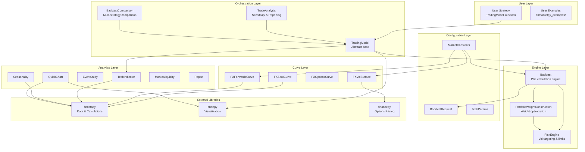
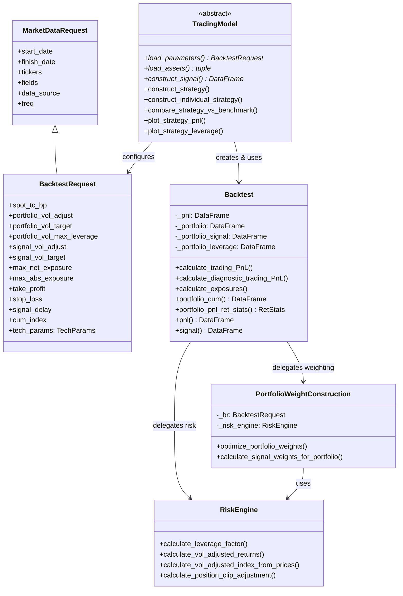
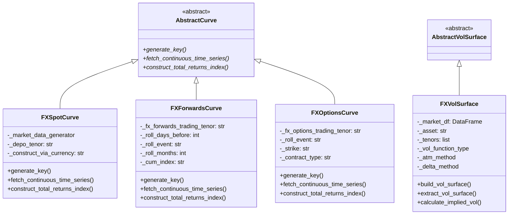
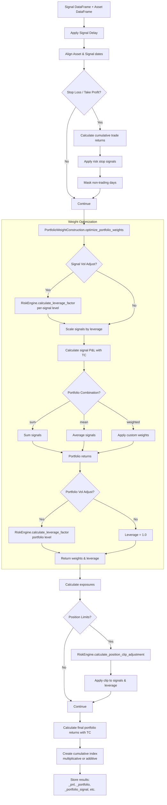
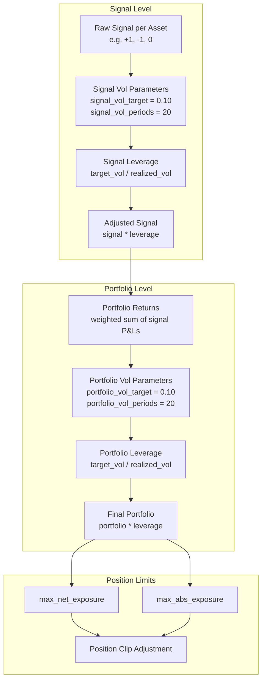
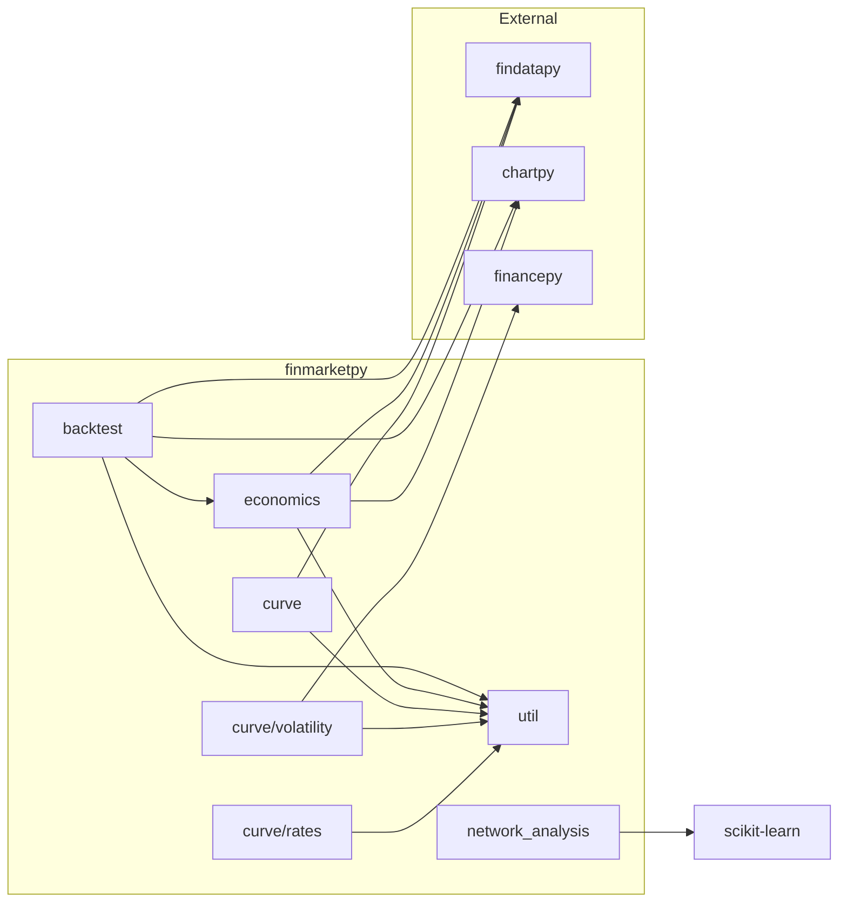

# Architecture

This document describes the design and architecture of finmarketpy, including its layered structure, class hierarchies, component interactions, and key design decisions.

## Trading Paradigm & Key Features

| Feature | Support | Details |
|---------|---------|---------|
| Backtesting Approach | Vector-based | Pandas DataFrame operations; signals and returns computed as full arrays |
| Live Trading | No | Library produces signals and analytics but does not connect to brokers |
| Paper Trading | No | No simulated execution engine |
| Multi-Asset | Yes | FX (spot, forwards, options), equities via findatapy data sources |
| Data Feeds | findatapy abstraction | Bloomberg, Quandl, FRED, Yahoo Finance, and others via findatapy |
| ML Integration | No | No built-in ML; scikit-learn used only for network analysis module |
| Risk Management | Built-in | Two-level volatility targeting (signal and portfolio), position limits (max net/abs exposure), stop-loss/take-profit |
| Optimization | No | No hyperparameter or portfolio optimization; sensitivity sweeps via TradeAnalysis |
| Execution | Simulated | Backtest-only P&L calculation with configurable transaction costs |

## System Layers

finmarketpy follows a layered architecture where each layer depends only on layers below it. External libraries (findatapy, chartpy, financepy) provide foundational capabilities.



## Class Hierarchy

### Backtest Module Inheritance

`BacktestRequest` extends findatapy's `MarketDataRequest`, inheriting all market data parameters while adding backtest-specific fields (transaction costs, vol targeting, position limits).



### Curve Module Hierarchy

The curve module uses an abstract base class pattern. Each concrete curve class handles a different asset class while sharing a common interface.



## Component Interactions

### Backtest Engine Internals

The `Backtest.calculate_trading_PnL()` method is the core computation pipeline. It coordinates signal processing, risk adjustments, and P&L calculation in a specific order.



### Two-Level Volatility Targeting

finmarketpy supports volatility targeting at two independent levels, each controlled by separate `BacktestRequest` parameters.



## Key Design Decisions

### 1. Configuration Override Pattern

`MarketConstants` defines all global settings as class-level attributes. Users override settings by creating a `marketcred.py` file with a `MarketCred` class in the same directory. The `MarketConstants.__init__()` method dynamically reads `MarketCred` attributes and overwrites its own. This pattern prevents user settings from being lost during library upgrades.

**Source**: `src/finmarketpy/util/marketconstants.py` (lines 140-159)

```python
# In marketconstants.py __init__:
try:
    from finmarketpy.util.marketcred import MarketCred
    for k in MarketConstants.__dict__.keys():
        if k in cred_keys and '__' not in k:
            setattr(MarketConstants, k, getattr(MarketCred, k))
except:
    pass
```

### 2. Inheritance from findatapy

`BacktestRequest` inherits from findatapy's `MarketDataRequest`, gaining all data retrieval parameters (tickers, data source, dates, frequency) while adding backtest-specific fields. This means a single object configures both data fetching and backtesting.

**Source**: `src/finmarketpy/backtest/backtestrequest.py` (line 26)

### 3. Abstract TradingModel Pattern

Users implement trading strategies by subclassing `TradingModel` and overriding three abstract methods: `load_parameters()`, `load_assets()`, and `construct_signal()`. The base class handles all backtest execution, benchmark comparison, plotting, and statistics. This clean separation means strategy logic is isolated from infrastructure.

**Source**: `src/finmarketpy/backtest/backtestengine.py` (lines 954-1020)

### 4. Numba Acceleration for Curve Construction

FX spot total return index calculation uses numba's `@guvectorize` decorator for performance-critical loops. A pure Python fallback (`_spot_index`) exists for environments where numba is unavailable.

**Source**: `src/finmarketpy/curve/fxspotcurve.py` (lines 31-60)

### 5. Parallel Processing Abstraction

Parallel execution uses findatapy's `SwimPool`, which abstracts over multiple multiprocessing backends (`multiprocess`, `multiprocessing`, `pathos`). The technique (threading vs multiprocessing) and thread count are configured in `MarketConstants` with platform-specific defaults (8 threads on Linux/Mac, 1 on Windows).

**Source**: `src/finmarketpy/util/marketconstants.py` (lines 32-41)

### 6. Blosc Compression for Parallel Backtests

When running portfolio sub-strategies in parallel, the final strategy's `Backtest` object (which is large) is compressed using blosc before being returned across process boundaries. This reduces memory pressure during multi-process execution.

**Source**: `src/finmarketpy/backtest/backtestengine.py` (lines 1376-1381)

## Module Dependency Graph



## Data Flow Summary

All data in finmarketpy flows as pandas DataFrames. Signals are typically represented as DataFrames with values of +1 (long), -1 (short), or 0 (flat). Asset prices are DataFrames with columns named `{ticker}.{field}` (e.g., `EURUSD.close`). Returns are computed from prices by `Calculations.calculate_returns()` from findatapy.

The library does not maintain persistent state between runs. Each `construct_strategy()` call is self-contained: it fetches data, generates signals, runs the backtest, and stores results as instance attributes on the `TradingModel` subclass. Results can then be plotted or exported via the various accessor methods (`strategy_pnl()`, `strategy_signal()`, etc.).

---
## See Also
- [README](README.md) — Project overview and quick start
- [Workflow](workflow.md) — Event flows and processing pipelines
- [State Management](state-management.md) — State lifecycle and data models
- [Development](development.md) — Development guide and best practices
