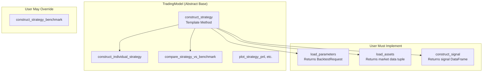
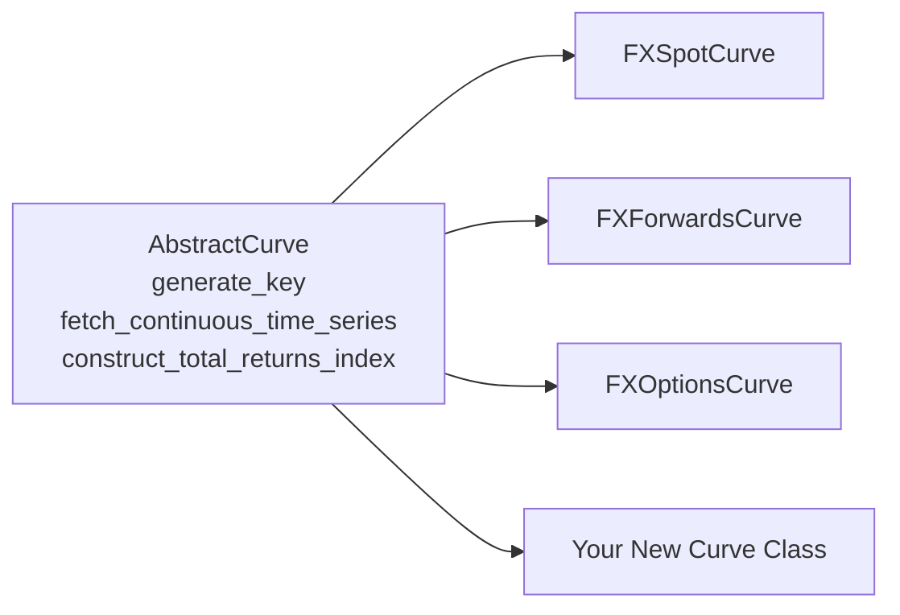
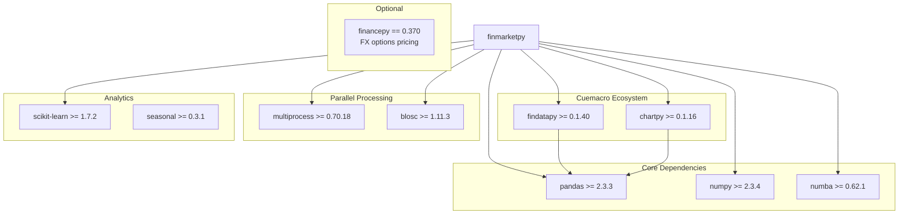

# Development Guide

This document covers development standards, design patterns, best practices, and extension points for finmarketpy.

## Build and Test

### Environment Setup

```bash
cd finmarketpy
make install          # Creates venv with uv, installs dependencies
```

### Running Tests

```bash
make test             # All tests via pytest
uv run pytest tests/test_backtestengine.py      # Specific file
uv run pytest tests/test_techindicator.py -v    # Verbose output
uv run pytest --cov=finmarketpy tests           # With coverage
```

### Code Quality

```bash
make fmt              # Pre-commit hooks: ruff linting/formatting
make deptry           # Dependency analysis
```

### Key Test Files

| File | Tests |
|------|-------|
| `tests/test_backtestengine.py` | Backtest execution, P&L calculation, signal handling |
| `tests/test_techindicator.py` | Technical indicator computation and signal generation |
| `tests/conftest.py` | Shared pytest fixtures |

## Design Patterns

### 1. Template Method Pattern (TradingModel)

`TradingModel` is the core extensibility point. It implements the Template Method pattern: the base class defines the algorithm skeleton in `construct_strategy()`, while subclasses provide specific implementations.



**Source**: `src/finmarketpy/backtest/backtestengine.py` (lines 954-1020)

### 2. Strategy Pattern (PortfolioWeightConstruction)

`BacktestRequest.portfolio_weight_construction` can be set to a custom `PortfolioWeightConstruction` instance. If not provided, a default one is created. This allows plugging in custom weighting schemes without modifying the engine.

```python
# In Backtest.calculate_trading_PnL():
if br.portfolio_weight_construction is None:
    pwc = PortfolioWeightConstruction(br=br)
else:
    pwc = br.portfolio_weight_construction
```

**Source**: `src/finmarketpy/backtest/backtestengine.py` (lines 247-250)

### 3. Configuration Override Pattern

Three-level configuration resolution (class defaults, MarketCred, runtime overrides) allows settings to be customized without modifying source code. See [State Management](state-management.md) for details.

### 4. Abstract Curve Pattern

`AbstractCurve` defines the interface for total return index construction. Each asset class (spot, forwards, options) implements the same three methods. This makes it straightforward to add support for new asset classes.



**Source**: `src/finmarketpy/curve/abstractcurve.py`

### 5. Lazy Evaluation

Expensive computations on `Backtest` results (trade counts, individual trade P&L) are deferred until first access:

```python
def trade_no(self) -> pd.DataFrame:
    if self._trade_no is None:
        calculations = Calculations()
        self._trade_no = calculations.calculate_trade_no(self._signal)
    return self._trade_no
```

## Extending finmarketpy

### Creating a Custom Trading Strategy

The most common extension is creating a new strategy by subclassing `TradingModel`.

```python
from finmarketpy.backtest import Backtest, BacktestRequest, TradingModel
from finmarketpy.economics import TechIndicator, TechParams
from findatapy.market import Market, MarketDataRequest, MarketDataGenerator

class FXMomentumStrategy(TradingModel):
    """FX momentum strategy using rate of change signals."""

    FINAL_STRATEGY = 'FX Momentum'

    def load_parameters(self, br=None):
        if br is None:
            br = BacktestRequest()

        br.start_date = '2005-01-01'
        br.finish_date = '2023-12-31'
        br.spot_tc_bp = 2.5
        br.ann_factor = 252

        # Signal-level vol targeting
        br.signal_vol_adjust = True
        br.signal_vol_target = 0.10
        br.signal_vol_periods = 60

        # Portfolio-level vol targeting
        br.portfolio_vol_adjust = True
        br.portfolio_vol_target = 0.10
        br.portfolio_vol_periods = 20

        # Position limits
        br.max_net_exposure = 3.0
        br.max_abs_exposure = 5.0

        # Technical parameters
        br.tech_params.roc_period = 60
        br.trading_field = 'close'

        return br

    def load_assets(self, br=None):
        if br is None:
            br = self.br

        # Define tickers and fetch data
        md_request = MarketDataRequest(
            start_date=br.start_date,
            finish_date=br.finish_date,
            data_source='your_data_source',
            tickers=['EURUSD', 'GBPUSD', 'USDJPY'],
            fields=['close'],
            freq='daily'
        )

        market = Market(market_data_generator=MarketDataGenerator())
        asset_df = market.fetch_market(md_request)
        spot_df = asset_df.copy()

        basket_dict = {
            'EURUSD': ['EURUSD'],
            'GBPUSD': ['GBPUSD'],
            'USDJPY': ['USDJPY'],
            self.FINAL_STRATEGY: ['EURUSD', 'GBPUSD', 'USDJPY']
        }

        return asset_df, spot_df, None, basket_dict

    def construct_signal(self, spot_df=None, spot_df2=None,
                         tech_params=None, br=None, run_in_parallel=False):
        if tech_params is None:
            tech_params = self.br.tech_params

        tech = TechIndicator()
        tech.create_tech_ind(spot_df, 'ROC', tech_params)
        return tech.get_signal()


# Run the strategy
model = FXMomentumStrategy()
model.construct_strategy()
model.plot_strategy_pnl()
```

### Adding a Custom Technical Indicator

Extend `TechIndicator` by adding a new branch in `create_tech_ind()` or by subclassing:

```python
from finmarketpy.economics.techindicator import TechIndicator
import pandas as pd
import numpy as np

class CustomTechIndicator(TechIndicator):
    """Extended technical indicators with custom signals."""

    def create_tech_ind(self, data_frame_non_nan, name, tech_params,
                        data_frame_non_nan_early=None):
        if name == "VWAP_CROSS":
            # Custom VWAP crossover signal
            data_frame = data_frame_non_nan.ffill()

            vwap = self._calculate_vwap(data_frame, tech_params)
            self._techind = vwap

            narray = np.where(data_frame > vwap, 1, -1)
            self._signal = pd.DataFrame(index=data_frame.index, data=narray)
            self._signal.columns = [
                x + " VWAP Signal" for x in data_frame.columns.values]
            self._techind.columns = [
                x + " VWAP" for x in data_frame.columns.values]
        else:
            # Fall back to parent for standard indicators
            super().create_tech_ind(data_frame_non_nan, name, tech_params,
                                    data_frame_non_nan_early)

    def _calculate_vwap(self, df, tech_params):
        # Custom VWAP calculation
        window = getattr(tech_params, 'vwap_period', 20)
        return df.rolling(window=window).mean()
```

### Adding a New Curve Class

To add total return index construction for a new asset class:

```python
from finmarketpy.curve.abstractcurve import AbstractCurve
from findatapy.market.ioengine import SpeedCache

class EquityIndexCurve(AbstractCurve):
    """Constructs total return indices for equity indices
    including dividend reinvestment.
    """

    def __init__(self, market_data_generator=None):
        self._market_data_generator = market_data_generator

    def generate_key(self):
        return SpeedCache().generate_key(
            self, ['_market_data_generator'])

    def fetch_continuous_time_series(self, md_request,
                                     market_data_generator):
        # Fetch price and dividend data
        ...

    def construct_total_returns_index(self, price_df, dividend_df):
        # Compute total return with dividend reinvestment
        ...
```

### Custom Portfolio Weight Construction

Replace the default weighting scheme by subclassing `PortfolioWeightConstruction`:

```python
from finmarketpy.backtest.backtestengine import PortfolioWeightConstruction

class RiskParityWeights(PortfolioWeightConstruction):
    """Risk parity weighting: inverse volatility allocation."""

    def optimize_portfolio_weights(self, returns_df, signal_df,
                                    signal_pnl_cols, br=None):
        # Compute inverse-vol weights
        vol = returns_df.rolling(60).std() * np.sqrt(252)
        inv_vol = 1.0 / vol
        weights = inv_vol.div(inv_vol.sum(axis=1), axis=0)

        # Continue with standard logic using custom weights
        ...

# Use in BacktestRequest:
br = BacktestRequest()
br.portfolio_weight_construction = RiskParityWeights(br=br)
```

## Code Conventions

### Naming

- Classes: `PascalCase` (e.g., `BacktestRequest`, `TradingModel`)
- Methods/functions: `snake_case` (e.g., `calculate_trading_PnL`, `create_tech_ind`)
- Private attributes: double underscore prefix in `BacktestRequest` properties (`self.__signal_delay`), single underscore in `Backtest` results (`self._pnl`)
- DataFrame columns: `{ticker}.{field}` format (e.g., `EURUSD.close`)

### Signal Conventions

- Long signal: `+1`
- Short signal: `-1`
- Flat/no position: `0`
- Signals are stored as DataFrames with the same index as asset prices
- Signal columns must correspond to asset columns

### Return Conventions

- Returns are simple period returns (not log returns)
- Cumulative indices: multiplicative (starting at 100) or additive (starting at 0), controlled by `BacktestRequest.cum_index`
- Transaction costs are expressed in basis points (bid to mid, so half-spread)
- Annualization factor: 252 trading days by default (`BacktestRequest.ann_factor`)

## Best Practices

### 1. Always Copy BacktestRequest Before Modifying

When running sensitivity analysis, always use `copy.copy()` to avoid mutating the original:

```python
import copy
br_modified = copy.copy(trading_model.load_parameters())
br_modified.spot_tc_bp = 5.0
```

### 2. Use MarketCred for Credentials

Never hardcode API keys or database passwords in strategy code. Create `src/finmarketpy/util/marketcred.py`:

```python
class MarketCred(object):
    db_username = 'your_username'
    db_password = 'your_password'
    backtest_thread_no = {'linux': 4, 'windows': 1, 'mac': 4}
```

### 3. Platform-Specific Threading

Set `backtest_thread_no` to 1 on Windows to avoid multiprocessing issues. On Linux/Mac, 4-8 threads typically works well. Some data providers rate-limit parallel requests.

### 4. Vol Target Consistency

When comparing strategies against benchmarks, apply the same vol target to both. `TradingModel.compare_strategy_vs_benchmark()` handles this automatically when `br.portfolio_vol_adjust = True`.

### 5. Signal Delay

Set `br.signal_delay = 1` to avoid look-ahead bias when signals are generated from close prices and trades execute on the next day's close.

## Dependency Architecture



### Optional Dependencies

- **financepy**: Required only for `FXVolSurface`, `FXOptionsPricer`, and `FXOptionsCurve`. Install with `pip install financepy==0.370 --no-deps` to avoid version conflicts.
- **blosc**: Required for parallel backtest compression. Import is wrapped in try/except.

## Troubleshooting

### Numba Cache Issues

If you see `Failed in nopython mode pipeline` errors (especially with financepy), delete `__pycache__` folders in the financepy installation directory.

### financepy Version Conflicts

financepy's API changes frequently. finmarketpy targets `financepy==0.370`. Install with `--no-deps` to prevent transitive dependency conflicts.

### Parallel Processing on Windows

Windows multiprocessing has known issues with pickling. Set:
```python
MarketConstants.backtest_thread_no = {'linux': 8, 'windows': 1, 'mac': 8}
```
Or in `marketcred.py`:
```python
class MarketCred(object):
    backtest_thread_no = {'linux': 8, 'windows': 1, 'mac': 8}
```

### Large Backtest Memory Usage

For large universes, the `Backtest` object stores many DataFrames. If memory is a concern:
- Use `compress_output=True` in `construct_individual_strategy()` (uses blosc compression)
- Reduce the number of parallel workers
- Process basket keys sequentially rather than in parallel

### Signal and Asset Column Mismatch

If the backtest raises `KeyError` or produces NaN P&L, verify that signal DataFrame columns match asset DataFrame columns exactly. The convention is `{ticker}.{field}` (e.g., `EURUSD.close`). Column names are case-sensitive and must align between signal, spot, and asset DataFrames.

### findatapy or chartpy Import Errors

finmarketpy depends on `findatapy` and `chartpy` from the Cuemacro ecosystem. These are not on the default PyPI index for all versions. Install from GitHub if pip fails: `pip install git+https://github.com/cuemacro/findatapy.git`. Ensure all three libraries use compatible versions.

## Configuration Reference

### BacktestRequest Parameters

| Parameter | Type | Default | Description |
|-----------|------|---------|-------------|
| `start_date` | str | None | Backtest start date (inherited from MarketDataRequest) |
| `finish_date` | str | None | Backtest end date (inherited from MarketDataRequest) |
| `spot_tc_bp` | float | None | Transaction cost in basis points (bid-to-mid, i.e. half-spread) |
| `trading_field` | str | `'close'` | Price field to use for trading signals |
| `signal_delay` | int | `0` | Bars to delay signal application (1 = avoid look-ahead bias) |
| `ann_factor` | int | `252` | Annualization factor for return statistics |
| `cum_index` | str | `'mult'` | Cumulative index type: `'mult'` (starts at 100) or `'add'` (starts at 0) |
| `portfolio_vol_adjust` | bool | `False` | Enable portfolio-level volatility targeting |
| `portfolio_vol_target` | float | `0.10` | Target annualized volatility (10%) |
| `portfolio_vol_periods` | int | `20` | Lookback window for vol estimation |
| `portfolio_vol_obs_in_year` | int | `252` | Observations per year for vol annualization |
| `portfolio_vol_max_leverage` | float | None | Maximum leverage cap (None = uncapped) |
| `portfolio_vol_rebalance_freq` | str | None | Rebalance frequency for vol targeting |
| `signal_vol_adjust` | bool | `False` | Enable signal-level volatility targeting |
| `signal_vol_target` | float | `0.10` | Target annualized volatility at signal level |
| `signal_vol_periods` | int | `20` | Lookback window for signal vol estimation |
| `max_net_exposure` | float | None | Maximum net portfolio exposure |
| `max_abs_exposure` | float | None | Maximum absolute portfolio exposure |
| `take_profit` | float | None | Take profit level (as fraction of entry) |
| `stop_loss` | float | None | Stop loss level (as fraction of entry) |
| `calc_stats` | bool | `True` | Calculate return statistics on output |
| `write_csv` | bool | `False` | Write results to CSV files |
| `portfolio_weight_construction` | object | None | Custom `PortfolioWeightConstruction` instance |

### TechParams Parameters

| Parameter | Type | Default | Description |
|-----------|------|---------|-------------|
| `fillna` | bool | `True` | Forward-fill NaN values before indicator calculation |
| `sma_period` | int | `20` | Simple moving average lookback period |
| `ema_period` | int | -- | Exponential moving average span |
| `roc_period` | int | -- | Rate of change lookback period |
| `sma2_period` | int | -- | Second SMA period for dual-SMA crossover |
| `atr_period` | int | `14` | Average True Range lookback period |
| `bb_period` | int | -- | Bollinger Bands lookback period |
| `bb_mult` | float | -- | Bollinger Bands standard deviation multiplier |
| `rsi_period` | int | -- | RSI lookback period |
| `rsi_upper` | float | -- | RSI overbought threshold |
| `rsi_lower` | float | -- | RSI oversold threshold |

### MarketConstants Settings

| Parameter | Type | Default | Description |
|-----------|------|---------|-------------|
| `backtest_thread_technique` | str | `'multiprocessing'` | Parallel backend: `'thread'` or `'multiprocessing'` |
| `backtest_thread_no` | dict | `{'linux': 8, 'windows': 1, 'mac': 8}` | Thread count per platform |
| `multiprocessing_library` | str | `'multiprocess'` | Library: `'multiprocess'`, `'multiprocessing'`, or `'pathos'` |
| `fx_forwards_trading_tenor` | str | `'1M'` | Default FX forwards trading tenor |
| `fx_forwards_roll_event` | str | `'month-end'` | Roll trigger: `'month-end'`, `'quarter-end'`, `'year-end'`, `'delivery-date'` |
| `fx_forwards_roll_days_before` | int | `5` | Days before roll event to execute roll |
| `fx_options_vol_function_type` | str | `'CLARK5'` | Vol surface model: `'CLARK5'`, `'CLARK'`, `'BBG'`, `'SABR'`, `'SABR3'` |
| `fx_options_pricing_engine` | str | `'financepy'` | Pricing engine: `'financepy'` or `'finmarketpy'` |
| `fx_options_solver` | str | `'nelmer-mead-numba'` | Optimizer: `'nelmer-mead'`, `'nelmer-mead-numba'`, `'cg'` |

## Security Considerations

- **Credential isolation**: Never store API keys or database passwords in source code. Create a `marketcred.py` file in `src/finmarketpy/util/` (excluded from version control) to override `MarketConstants` defaults. The `MarketCred` class attributes automatically override matching `MarketConstants` attributes at instantiation.
- **Database access**: MongoDB connection parameters (`db_server`, `db_port`, `db_username`, `db_password`) are configured via `MarketConstants`. In production, override these via `MarketCred` and restrict database network access to trusted hosts.
- **Parallel processing risks**: When using `multiprocessing` backend, ensure that pickled objects (strategies, data) do not contain credentials. The `multiprocess` library uses `dill` serialization which can serialize closures containing sensitive data.
- **Third-party data sources**: findatapy connects to external data providers (Quandl, Bloomberg, etc.). Audit `MarketDataRequest` parameters before execution to avoid unintended data provider calls that may incur API charges.
- **Dependency pinning**: Pin `financepy==0.370` exactly -- newer versions have breaking API changes. Use `--no-deps` when installing to prevent transitive dependency conflicts that could introduce vulnerable packages.
- **Log output**: The `LoggerManager` may log market data request parameters including ticker symbols and date ranges. In regulated environments, ensure log storage complies with data handling policies.

---
## See Also
- [README](README.md) — Project overview and quick start
- [Architecture](architecture.md) — System design and components
- [Workflow](workflow.md) — Event flows and processing pipelines
- [State Management](state-management.md) — State lifecycle and data models
