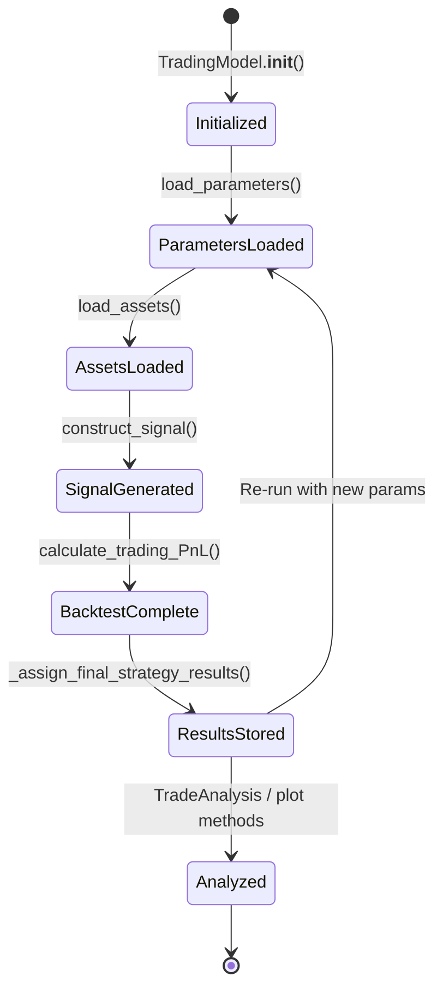
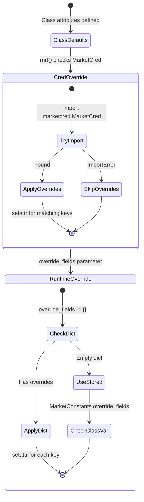
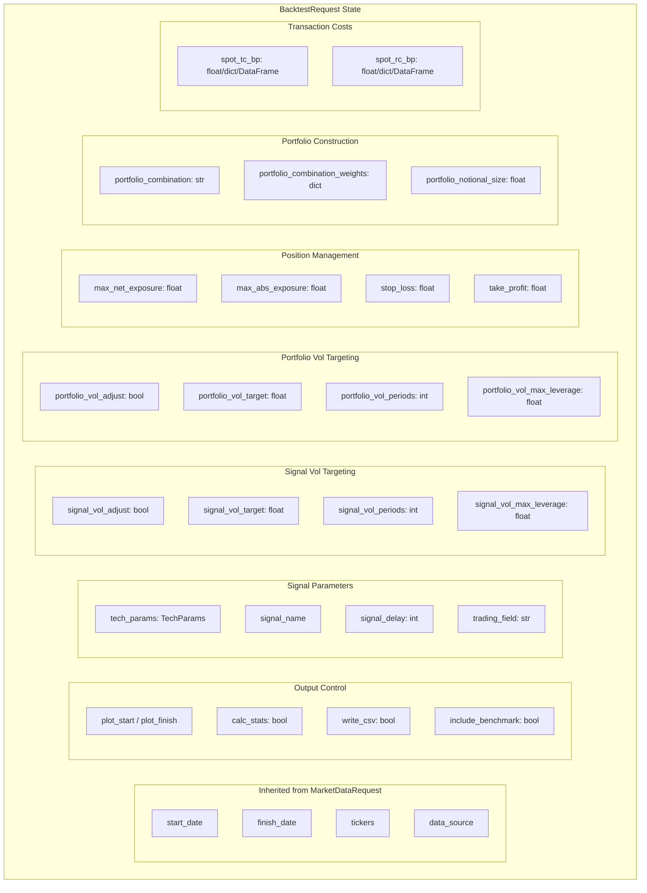
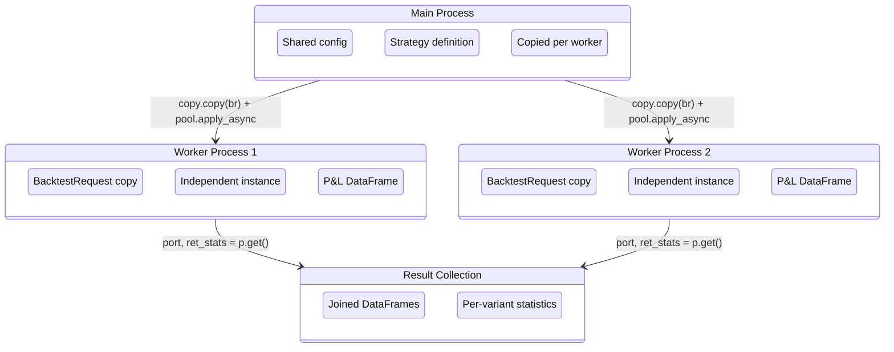

# State Management

This document describes how finmarketpy manages market data state, configuration, caching, and the lifecycle of backtest results across the library's components.

## Overview

finmarketpy is primarily a stateless, batch-processing library. Each backtest run is self-contained: data is fetched, signals are computed, P&L is calculated, and results are stored as instance attributes. There is no persistent state between sessions. However, several important state management patterns exist within a session.



## Configuration State

### MarketConstants Lifecycle

`MarketConstants` uses a class-level attribute pattern with runtime override capability. All settings are defined as class attributes (not instance attributes), meaning they are shared across all instances.



### Configuration Override Chain

Settings are resolved in this order (later overrides earlier):

1. **Class defaults** in `marketconstants.py` -- Shipped with the library
2. **MarketCred overrides** from `marketcred.py` -- User-created file in the same directory, not tracked in version control
3. **Runtime overrides** via `override_fields` dict -- Passed at construction time

**Source**: `src/finmarketpy/util/marketconstants.py` (lines 140-159)

```python
class MarketConstants(object):
    # Level 1: Class defaults
    backtest_thread_no = {'linux': 8, 'windows': 1, 'mac': 8}
    db_server = '127.0.0.1'

    def __init__(self, override_fields={}):
        # Level 2: MarketCred overrides
        try:
            from finmarketpy.util.marketcred import MarketCred
            for k in MarketConstants.__dict__.keys():
                if k in cred_keys and '__' not in k:
                    setattr(MarketConstants, k, getattr(MarketCred, k))
        except:
            pass

        # Level 3: Runtime overrides
        for k in override_fields.keys():
            if '__' not in k:
                setattr(MarketConstants, k, override_fields[k])
```

### Key Configuration Categories

| Category | Settings | Default |
|----------|----------|---------|
| **Parallel Processing** | `backtest_thread_technique`, `backtest_thread_no`, `multiprocessing_library` | `"multiprocessing"`, `{linux: 8, windows: 1, mac: 8}`, `"multiprocess"` |
| **FX Forwards** | `fx_forwards_trading_tenor`, `fx_forwards_roll_event`, `fx_forwards_roll_days_before` | `"1M"`, `"month-end"`, `5` |
| **FX Options** | `fx_options_vol_function_type`, `fx_options_atm_method`, `fx_options_delta_method`, `fx_options_solver` | `"CLARK5"`, `"fwd-delta-neutral-premium-adj"`, `"spot-delta-prem-adj"`, `"nelmer-mead-numba"` |
| **Database** | `db_server`, `db_port`, `db_username`, `db_password`, `write_engine` | `"127.0.0.1"`, `"27017"`, `"admin_root"`, `"TOFILL"`, `"arctic"` |

## BacktestRequest State

`BacktestRequest` is the central configuration object for a backtest. It inherits from findatapy's `MarketDataRequest` and holds all parameters that control backtest behavior. Each parameter has a private backing field with a property getter/setter.



### Transaction Cost Handling

Transaction costs (`spot_tc_bp`) and roll costs (`spot_rc_bp`) support three input formats. The setter automatically normalizes the input:

- **Scalar** (float): Applied uniformly. Converted from basis points to decimal: `value / (2 * 100 * 100)` for TC (half-spread), `value / (100 * 100)` for RC.
- **Dict**: Per-asset costs. Each value converted separately.
- **DataFrame**: Time-varying costs. Assumed to be already in percentage form (bid to mid).

**Source**: `src/finmarketpy/backtest/backtestrequest.py` (lines 430-465)

## Backtest Result State

After `Backtest.calculate_trading_PnL()` completes, results are stored as instance attributes on the `Backtest` object. These are then transferred to the `TradingModel` via `_assign_final_strategy_results()`.

```mermaid
stateDiagram-v2
    state "Backtest Instance" as BT {
        state "Signal State" as SS {
            _signal: Raw signals
            _portfolio_signal: After vol & position adjustments
            _portfolio_trade: Period-over-period changes
        }

        state "P&L State" as PS {
            _pnl: Individual signal P&L
            _pnl_cum: Cumulative individual P&L
            _components_pnl: After portfolio constraints
            _components_pnl_cum: Cumulative after constraints
            _portfolio: Final portfolio returns
            _portfolio_cum: Cumulative portfolio
        }

        state "Leverage State" as LS {
            _individual_leverage: Per-signal leverage
            _portfolio_leverage: Portfolio-level leverage
        }

        state "Exposure State" as ES {
            _portfolio_total_longs: Long exposure
            _portfolio_total_shorts: Short exposure
            _portfolio_net_exposure: Net exposure
            _portfolio_total_exposure: Absolute exposure
        }

        state "Statistics State" as STS {
            _pnl_ret_stats: RetStats for signals
            _components_pnl_ret_stats: RetStats after constraints
            _portfolio_ret_stats: RetStats for portfolio
        }

        state "Notional State (Optional)" as NS {
            _portfolio_signal_notional: Positions * notional
            _portfolio_signal_trade_notional: Trades * notional
            _portfolio_signal_contracts: Positions in contracts
        }
    }
```



### Lazy Computation

Some expensive calculations are deferred until first access:

- `trade_no()` -- Trade count is computed on first call via `Calculations.calculate_trade_no()` and cached in `_trade_no`.
- `pnl_trades()` -- Individual trade P&L is computed on first call via `Calculations.calculate_individual_trade_gains()` and cached.
- `portfolio_trade_no()` -- Same pattern for portfolio-level trade count.

**Source**: `src/finmarketpy/backtest/backtestengine.py` (lines 582-608, 757-770)

## TradingModel Result State

After `construct_strategy()` completes, the `TradingModel` instance holds comprehensive strategy results:

| Attribute | Type | Description |
|-----------|------|-------------|
| `_strategy_pnl` | DataFrame | Final strategy cumulative P&L |
| `_strategy_components_pnl` | DataFrame | Per-asset cumulative P&L (after portfolio adjustments) |
| `_strategy_signal` | DataFrame | Position sizes for each asset |
| `_strategy_trade` | DataFrame | Trade sizes per period |
| `_strategy_leverage` | DataFrame | Portfolio leverage time series |
| `_individual_leverage` | DataFrame | Per-asset leverage |
| `_strategy_pnl_ret_stats` | RetStats | Portfolio return statistics |
| `_strategy_group_pnl` | DataFrame | All basket cumulative P&Ls |
| `_strategy_group_benchmark_pnl` | DataFrame | Strategy vs benchmark |
| `_strategy_total_longs` | DataFrame | Total long exposure |
| `_strategy_total_shorts` | DataFrame | Total short exposure |

### Notional and Contract Sizes

When `BacktestRequest.portfolio_notional_size` is set, additional state is computed:

- `_strategy_signal_notional` -- Positions in notional terms (e.g., USD)
- `_strategy_trade_notional` -- Trades in notional terms
- `_strategy_signal_contracts` -- Positions in contract units (requires `contract_value_df`)
- `_strategy_trade_contracts` -- Trades in contract units

## Caching Strategy

finmarketpy itself does not implement caching. It delegates to findatapy, which supports:

- **In-memory cache** via `SpeedCache` -- LRU cache keyed on request parameters
- **Disk cache** -- Parquet/HDF5 file storage
- **Database cache** -- MongoDB/Arctic for time series storage

The `FXSpotCurve.generate_key()` method uses findatapy's `SpeedCache.generate_key()` to create cache keys, deliberately excluding large objects like `_market_data_generator` and `_calculations` from the key.

**Source**: `src/finmarketpy/curve/fxspotcurve.py` (lines 82-87)

```python
def generate_key(self):
    from findatapy.market.ioengine import SpeedCache
    return SpeedCache().generate_key(self, ['_market_data_generator',
                                            '_calculations'])
```

## Parallel Execution State

When running backtests in parallel (for sensitivity analysis or multi-basket strategies), state is managed carefully to avoid issues with shared mutable state.



Key state isolation mechanisms:
- `BacktestRequest` is deep-copied via `copy.copy()` before modifying parameters for each parallel worker.
- Each worker creates its own `Backtest` instance.
- The final strategy backtest object is compressed with `blosc.compress(pickle.dumps(backtest))` before being returned across process boundaries when `compress_output=True`.
- After all parallel results are collected, `MarketConstants` state in the main process is unchanged.

**Source**: `src/finmarketpy/backtest/tradeanalysis.py` (lines 258-298), `src/finmarketpy/backtest/backtestengine.py` (lines 1139-1217)

## Reset and Re-Run

After sensitivity analysis, `TradeAnalysis` resets the strategy parameters to their original values:

```python
# Reset the parameters of the strategy after sensitivity run
trading_model.br = trading_model.load_parameters()
```

This ensures that the `TradingModel` instance returns to a clean state after parameter sweeps, allowing it to be reused for additional analysis.

**Source**: `src/finmarketpy/backtest/tradeanalysis.py` (line 334)

---
## See Also
- [README](README.md) — Project overview and quick start
- [Architecture](architecture.md) — System design and components
- [Workflow](workflow.md) — Event flows and processing pipelines
- [Development](development.md) — Development guide and best practices
