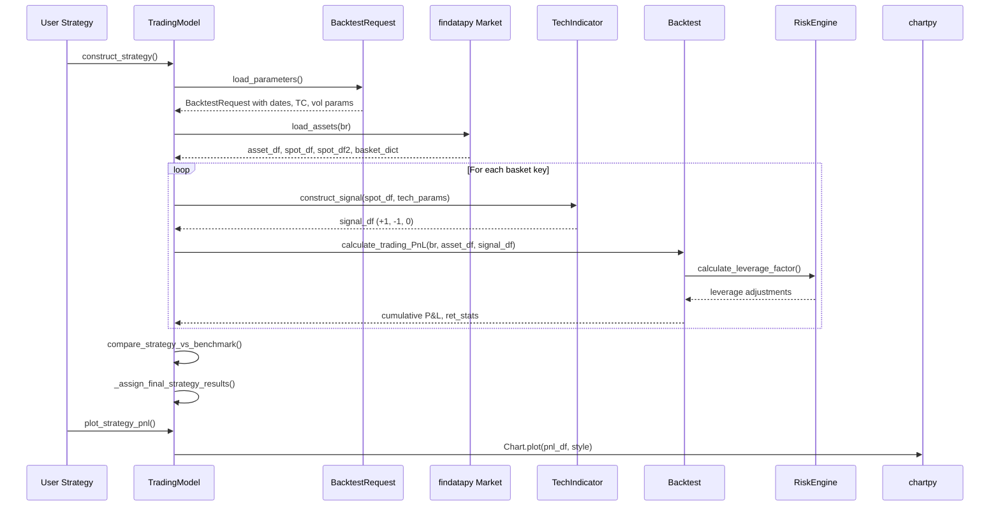
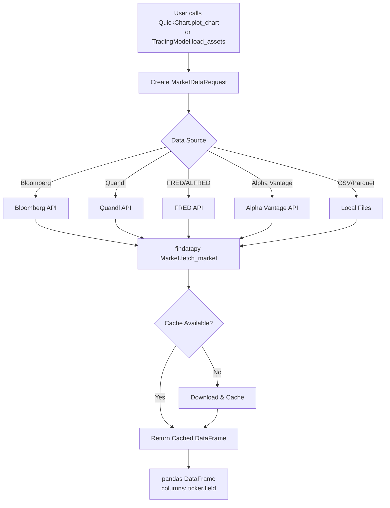
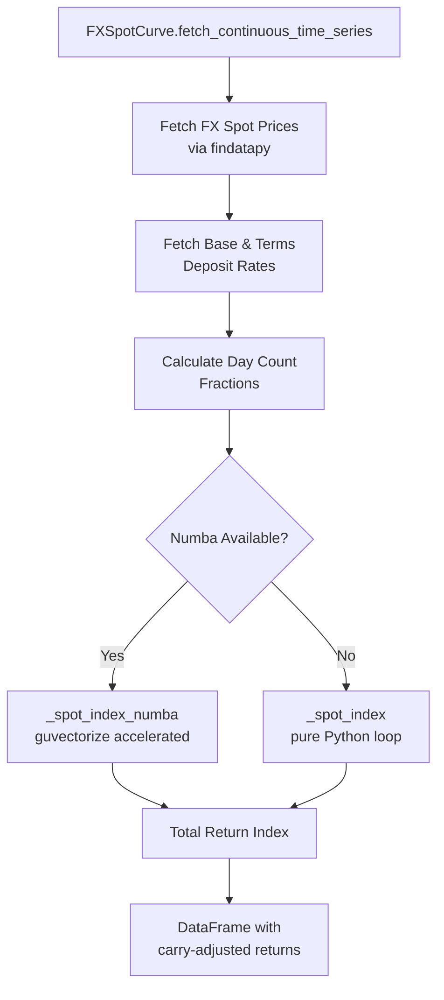
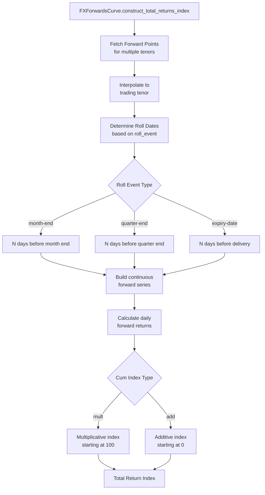
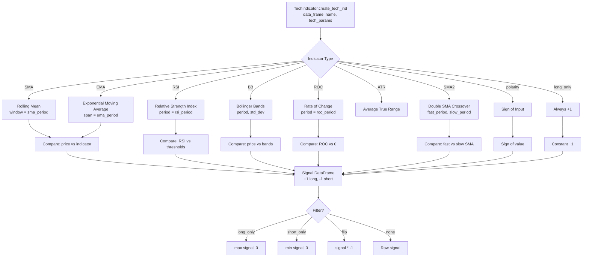
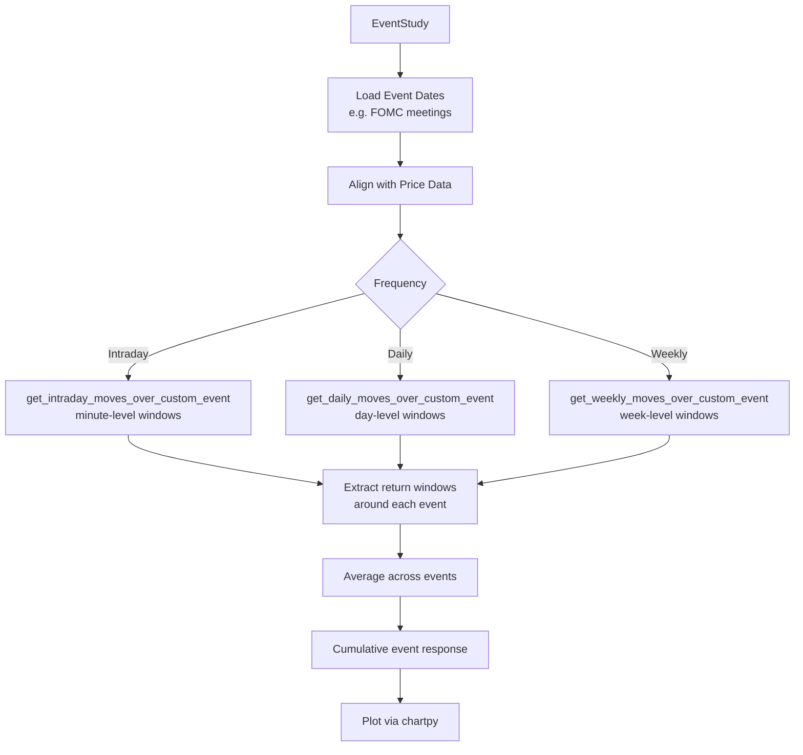
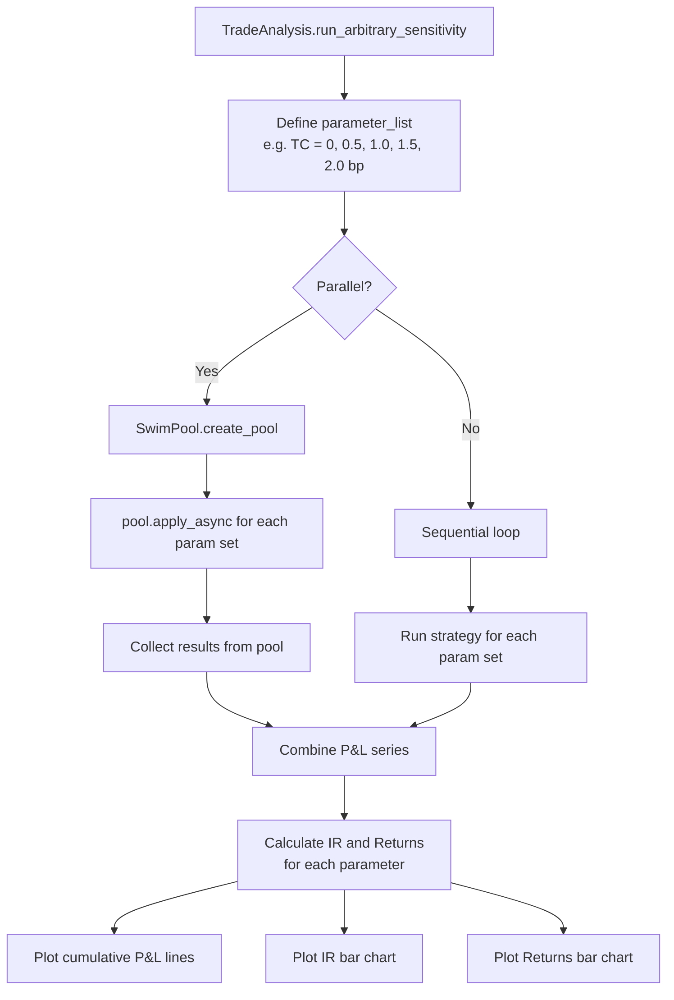
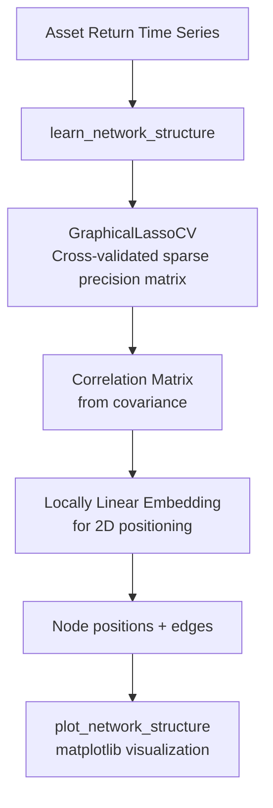
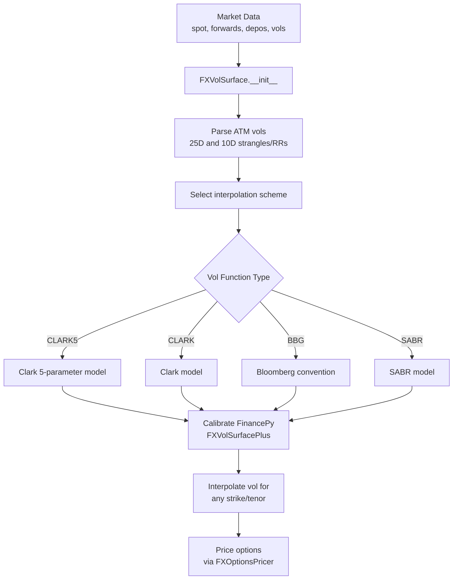

# Workflow

This document describes the key workflows in finmarketpy: data fetching, backtesting, analytics, and visualization. Each workflow is illustrated with mermaid diagrams and references to actual source files.

## Strategy Backtesting Workflow

The primary workflow is constructing and backtesting a trading strategy. This is orchestrated by the `TradingModel.construct_strategy()` method in `src/finmarketpy/backtest/backtestengine.py`.

### End-to-End Flow



### Step-by-Step Breakdown

1. **Parameter Loading** -- `load_parameters()` creates a `BacktestRequest` object with all backtest settings: date range, transaction costs (in basis points), volatility targeting parameters, position limits, stop loss/take profit levels, and technical indicator parameters via `TechParams`.

2. **Asset Loading** -- `load_assets()` uses findatapy's `Market` class to fetch market data. Returns a tuple of `(asset_df, spot_df, spot_df2, basket_dict)` where `basket_dict` maps strategy names to lists of tickers.

3. **Signal Construction** -- `construct_signal()` generates trading signals (typically +1 for long, -1 for short). Uses `TechIndicator` or custom logic. The signal DataFrame must have matching columns to the asset DataFrame.

4. **P&L Calculation** -- `Backtest.calculate_trading_PnL()` handles:
   - Signal delay application
   - Date alignment between assets and signals
   - Stop loss / take profit signal modification
   - Signal-level volatility adjustment
   - Portfolio-level volatility adjustment
   - Position limit enforcement
   - Transaction cost application
   - Cumulative index construction

5. **Analysis** -- `TradeAnalysis` provides post-backtest tools: TC sensitivity, parameter sweeps, seasonality of strategy returns, and HTML report generation.

## Data Fetching Workflow

Market data retrieval is handled by findatapy, but finmarketpy provides convenience wrappers, particularly `QuickChart` in `src/finmarketpy/economics/quickchart.py`.



### QuickChart One-Line Usage

`QuickChart` wraps the entire data fetch + plot workflow into a single method call:

```python
from finmarketpy.economics import QuickChart

qc = QuickChart(engine='plotly', data_source='fred')
qc.plot_chart(
    tickers={'US 10Y': 'DGS10'},
    start_date='2020-01-01',
    title='US 10 Year Treasury Yield'
)
```

**Source**: `src/finmarketpy/economics/quickchart.py`

## FX Total Return Index Workflow

Constructing FX total return indices involves fetching spot rates, deposit rates, and forward points, then computing carry-adjusted returns. This is handled by the curve module.

### FX Spot Total Return Index



The total return index formula for each day `i` is:

```
TRI[i] = TRI[i-1] * (1 + (1 + base_depo * dt / base_daycount) * (spot[i] / spot[i-1])
                         - (1 + terms_depo * dt / terms_daycount))
```

**Source**: `src/finmarketpy/curve/fxspotcurve.py` (lines 31-60)

### FX Forwards Roll Workflow



Roll parameters are configured in `MarketConstants`:
- `fx_forwards_roll_event`: When to roll (`'month-end'`, `'quarter-end'`, `'year-end'`, `'delivery-date'`)
- `fx_forwards_roll_days_before`: How many days before the event to roll (default: 5)
- `fx_forwards_roll_months`: Roll frequency in months (default: 1)
- `fx_forwards_trading_tenor`: Primary trading tenor (default: `'1M'`)

**Source**: `src/finmarketpy/curve/fxforwardscurve.py`

## Analytics Workflows

### Technical Indicator Signal Generation



**Source**: `src/finmarketpy/economics/techindicator.py`

### Seasonality Analysis

The `Seasonality` class in `src/finmarketpy/economics/seasonality.py` provides multiple temporal aggregation methods:

- `time_of_day_seasonality()` -- Average returns by hour/minute of day (for intraday data)
- `bus_day_of_month_seasonality()` -- Average returns by business day of month
- `monthly_seasonality()` -- Average returns by calendar month

These can be computed across all years or broken down year-by-year for comparison.

### Event Study Workflow



The `EventStudy` class handles timezone conversions (UTC to New York), NY 10am cutoff logic for FX markets, and alignment of event dates with business day calendars.

**Source**: `src/finmarketpy/economics/eventstudy.py`

## Sensitivity Analysis Workflow

`TradeAnalysis` in `src/finmarketpy/backtest/tradeanalysis.py` supports parameter sweep analysis:



Built-in sensitivity tests include:
- `run_tc_shock()` -- Transaction cost sensitivity (0bp to 2bp in 0.25bp steps)
- `run_arbitrary_sensitivity()` -- Any parameter combination from `BacktestRequest`

**Source**: `src/finmarketpy/backtest/tradeanalysis.py` (lines 229-381)

## Visualization Workflow

finmarketpy uses chartpy for all visualization. The `TradingModel` base class provides built-in plotting methods that produce standardized output.

### Strategy Report Generation

`TradeAnalysis.run_strategy_returns_stats()` generates a multi-panel HTML report:

```python
# Generates 6-panel Canvas:
# [strategy_pnl,        individual_trade_pnl]
# [component_pnl,       component_IR]
# [portfolio_leverage,   individual_leverage]
canvas = Canvas([[pnl, individual],
                 [pnl_comp, ir_comp],
                 [leverage, ind_lev]])
canvas.generate_canvas(page_title='Strategy Return Statistics')
```

Available plot methods on `TradingModel`:
- `plot_strategy_pnl()` -- Final strategy cumulative P&L
- `plot_strategy_group_pnl_trades()` -- Individual asset P&L contributions
- `plot_strategy_group_benchmark_pnl()` -- Strategy vs benchmark
- `plot_strategy_group_benchmark_pnl_ir()` -- Information ratios
- `plot_strategy_leverage()` -- Portfolio leverage over time
- `plot_strategy_group_leverage()` -- Per-asset leverage

**Source**: `src/finmarketpy/backtest/tradeanalysis.py` (lines 55-147)

## Network Analysis Workflow

The `src/finmarketpy/network_analysis/` module uses scikit-learn's graphical LASSO to learn the conditional independence structure of asset returns.



**Source**: `src/finmarketpy/network_analysis/learn_network_structure.py`

## FX Volatility Surface Workflow

The `FXVolSurface` class constructs and interpolates FX vol surfaces using FinancePy as a backend.



**Source**: `src/finmarketpy/curve/volatility/fxvolsurface.py`

---
## See Also
- [README](README.md) — Project overview and quick start
- [Architecture](architecture.md) — System design and components
- [State Management](state-management.md) — State lifecycle and data models
- [Development](development.md) — Development guide and best practices
